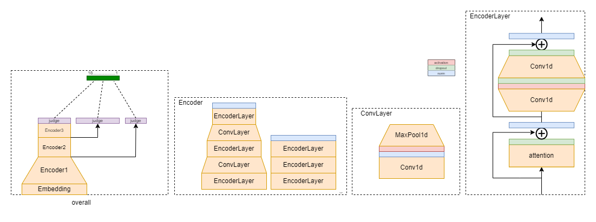

# Kaggle Competition: Predict Student Performance from Game Play  
比赛开始于2023年2月6日，结束于2023年5月8日。其的目的是通过学生在一款名叫Jo Wilder的在线教育游戏上的表现，
来预测学生的答题情况。奖金池总共55000美金。

链接：https://www.kaggle.com/competitions/predict-student-performance-from-game-play/overview
具体的输入输出和比赛要求，参考链接中的比赛介绍。

## 我的模型

